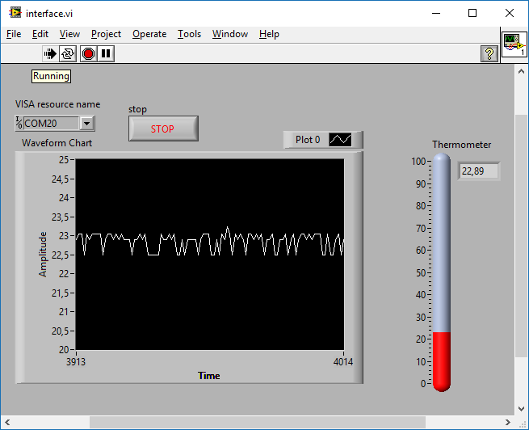

# Código exemplo do LM35 com o launchpad TIVA C Series TM4C123G
Código de exemplo do launchpad TIVA C que faz a leitura do sensor LM35. O sensor está conectado na entrada analógica 11 (A11), onde o código permite fazer a média móvel do sinal para redução de ruídos. Adicionalmente, o usuário pode configurar o número de médias (SIZE) e o período de envio de dados (PERIOD). A interface foi feita em Labview (interface.vi) e permite a visualização do valor lido pelo sensor através de um termômetro e um gráfico temporal. 

## Adaptação para Arduino
Como o tiva é muito mais poderoso que o arduino, alguns cuidados devem ser tomados ao tentar adaptar o código. O principal desafio e a limitada quantidade de memória de dados. Recomenda-se diminuir o número de médias e/ou mudar algumas variáveis de "long" para "int".

## Utilização da interface em Labview
É necessário o Labview 2009 ou versão superior para executar a interface. Para iniciar a leitura de temperatura siga os seguintes passos:
1. Conecte o TIVA C em uma porta USB do computador;
2. Grave a aplicação *lm35_average.ino*, localisada na pasta */tiva*, em seu launchpad, utilizando a IDE **energia** ([site para download do energia](energia.nu));
3. Abra a aplicação *interface.vi* localizada na pasta */interface_labview*;
4. Selecione a porta de comunicação onde o TIVA C está conectado v(ocê pode verificar a porta no gerenciador de dispositivos, caso esteja utilizando Windows);
5. Clique no botão Run do Labview (botão com a seta para a direita);
3. O programa estará rodando.

